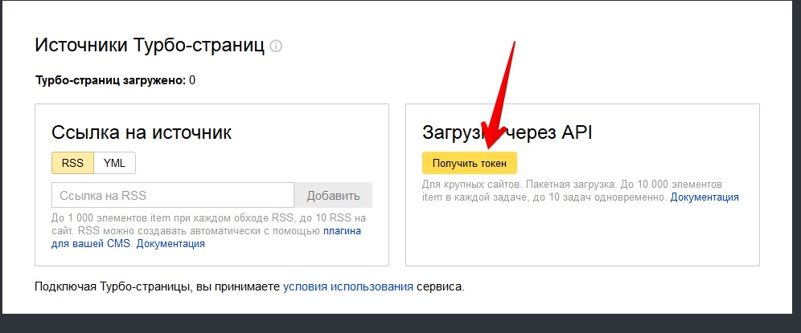

											

	 Расскажем как настроить выгрузку турбо-страниц Яндекс через API с помощью нашего модуля для 1С-Битрикса. Данный способ имеет меньше ограничений на количество передаваемых страниц. Если стандартный способ (с помощью RSS) позволяет загрузить только 1000 элементов в одной RSS (но не больше 10 RSS), то API позволяет загружать неограниченное количество. Единственное ограничение, что за один раз можно передать до 10 файлов, и в каждом из файлов не более 10 000 элементов. Пока они не обработаются больше передать не получится.

	 Приступим непосредственно к настройке. В начале нам нужно получить токен в Я.Вебмастере, для этого заходим в сервис, выбрем свой сайт, заходим&nbsp;в настройки и нажимаем&nbsp;кнопку «Получить токен».

 &nbsp;&nbsp;

  
	 Затем переходим в административную часть Битрикса, заходим в настройки модуля «Турбо-страницы API» и вставляем полученный токен в поле «Токен»: 

 

  
	 Получаем идентификатор пользователя:

  

  
	 Следующим шагом нам нужно выбрать сайт для связи модуля с вебмастером.&nbsp;<b>Внимание если ваш сайт работает по https, то у вас будет такого вида адрес:&nbsp;https:адрес_сайта.ru:443</b>

 <b> </b>

  
	 После сохранения настроек у вас должен получиться следующий вид:

 

  
	 На этом основные настройки по связыванию модуля с API Турбо-страниц Яндекса завершены. Перейдем непосредственно к настройкам выгрузки инфоблоков.

	 Выделим сразу основные моменты:&nbsp;

<ul>
	<li>в разделе "Список RSS-каналов" будут все настройки текущих выгрузок в Турбо-страницы;</li>
	<li>один RSS-канал — один инфоблок, для выгрузки другого инфоблока нужно будет создать еще один RSS-канал.</li>
</ul>
<h2>Настройка выгрузки инфоблока в Турбо-страницы</h2>

	 Добавляем RSS:

 

  
	 Выбираем инфоблок для выгрузки:

 

  
	 После выбора инфоблока заполняем остальные поля, у модуля есть большое количество настроек, которое позволяет полностью настроить выгрузку элементов инфоблока, даже если у вас нестандартная реализация. При стандартном исполнении первые пункты настроек до «Описание канала» желательно не трогать. 

<h2>Настройки для интернет-магазинов</h2>
  

  
	 Выберите свойства товаров и свойства торговых предложений (при наличии) для отображения в турбо-страницах:

  

	 Поля которые нужно заполнить для всех вариантов шаблона:

<ul>
	<li>Меню (заполняется относительными путями без домена);</li>
	<li>Блок ссылок (по желанию, есть возможность включить Авторекомендации Яндекс);</li>
	<li>Кнопки поделиться (выбор из соц. сетей);</li>
	<li>Формы обратной связи —&nbsp;<b>внимание для работы блока обязательные поля для заполнения: Юр. название</b>&nbsp;и&nbsp;<b>Ссылка на пользовательское соглашение;</b></li>
	<li>Блок обратной связи — выбор из нескольких вариантов расположения на сайте (слева, справа, внизу страницы),&nbsp;<b>внимание при выборе «Форма обратной связи» e-mail должен быть с этого же домена, иначе будут ошибки в вебмастере.</b></li>
</ul>
<h2>Сквозные блоки на турбо-страницах (информационные разделы)</h2>

	 Для информационных разделов есть возможность забрать контент из какого-либо свойства или склеить несколько значений. Так же вы можете написать свой текст как на скриншоте ниже.&nbsp;<b>Внимание данные разделы будут доступны на всех страницах инфоблока, который вы выгружаете через модуль.</b>

 

	 После заполнения всех настроек сохраняем заполненные данные.

<h2>Отладка отображения турбо-страниц</h2>

	 Переходим к отладке. Для этого нужно перейти на вкладку "Отладка отображения Турбо-страницы" и нажать кнопку "Запустить".

 

  
	 После нажатия кнопки вы будете перенаправлены на страницу с информацией о текущей загрузке:

 

  
	 В API Турбо-страниц есть 3 статуса загрузки:

<ul>
	<li>PROCESSING - обработка и проверка на ошибки;</li>
	<li>OK - загружен без ошибок;</li>
	<li>WARNING - обнаружены не поддерживаемые элементы;</li>
	<li>ERROR - обнаружены ошибки.</li>
</ul>

	 При первой загрузке время проверки обычно составляет несколько часов. Чтобы обновить статус нужно нажать на кнопку «Обновить».&nbsp;

	 После завершения проверок и отсутствия ошибок вид RSS должен быть таким:

  

  
	 Если у вас все таки появятся ошибки, то посмотреть их можно будет на вкладке «Ошибки», где будет указано в каких элементах найдены ошибки. На второй вкладке «Страницы» вы можете посмотреть вид выгруженной турбо-страницы в Яндекс.

 
<h2>Отправка Турбо-Страниц в Яндекс</h2>

	 После проверки 10 выгруженных страниц, и отсутствие ошибок можно перейти к выгрузке всех элементов инфоблока в Яндекс. Для этого перейдите в «Список RSS-каналов» зайдите в настроенный канал и перейдите на вкладку «Публикация Турбо-страниц»

 

  
	 Модуль выгрузит все ваши элементы с соблюдением всех ограничений API Яндекса.

	 Ограничения в модуле следующие:

<ul>
	<li>Не более 10 000 элементов в одном файле;</li>
	<li>Размер файла не более 10 Мб;</li>
</ul>

 <b>Внимание если у вас появляются ошибки на размер файла измените количество элементов в фиде с помощью настройки "Кол-во элементов в фиде":</b> 

 <b> 
 </b>

	 Статус окончания генерации выглядит так:

 

 <b> 
	 Внимание! </b>При повторных запусках выгрузки, модуль будет искать новые элементы в инфоблоке по дате изменения от последней выгрузки, и если они не будут найдены загрузка производится не будет. Но если есть не отправленные файлы с предыдущей выгрузки, то сначала будут отправлены они. Для принудительного запуска полной выгрузки нужно нажать чек-бокс «Полная выгрузка» на вкладке «Основная».

	 После успешной обработки всех страниц в веб-мастере можно будет увидеть подобный статус, последнего загруженного файла:

 

  
	 На этом настройка модуля закончена.&nbsp;

<h2>Настройка выгрузки разделов в турбо-страницы</h2>

	Для настройки выгрузки разделов необходимо перейти в пункт "Разделы" в меню "Список RSS-каналов" и нажать кнопку "Добавить RSS-канал"

	 

	Выбираем инфоблок (как и для выгрузки элементов) и переходим к настройке выгрузки.&nbsp;

	Выбираем шаблон (для интернет-магазинов catalog).

	 

	Переходим к настройкам вывода информации и элементов в разделе:

	Для удобства есть дополнительные условия отбора как разделов так и элементов. На данных вкладках вы можете настроить необходимую фильтрацию выгрузки разделов и элементов в турбо-страницы.

	<b>Фильтр для разделов</b>:

	<b>Фильтр для элементов:</b>

	<b> 
	</b>

<h3>Дополнительные возможности модуля</h3>

	 Модуль позволяет полностью настроить шаблон выгрузки в турбо-страницы Яндекса используя все возможности, которые сейчас поддерживаются. Для этого вы можете обратиться к нам за индивидуальной настройкой выгрузки или доработать шаблон собственными силами.

						
